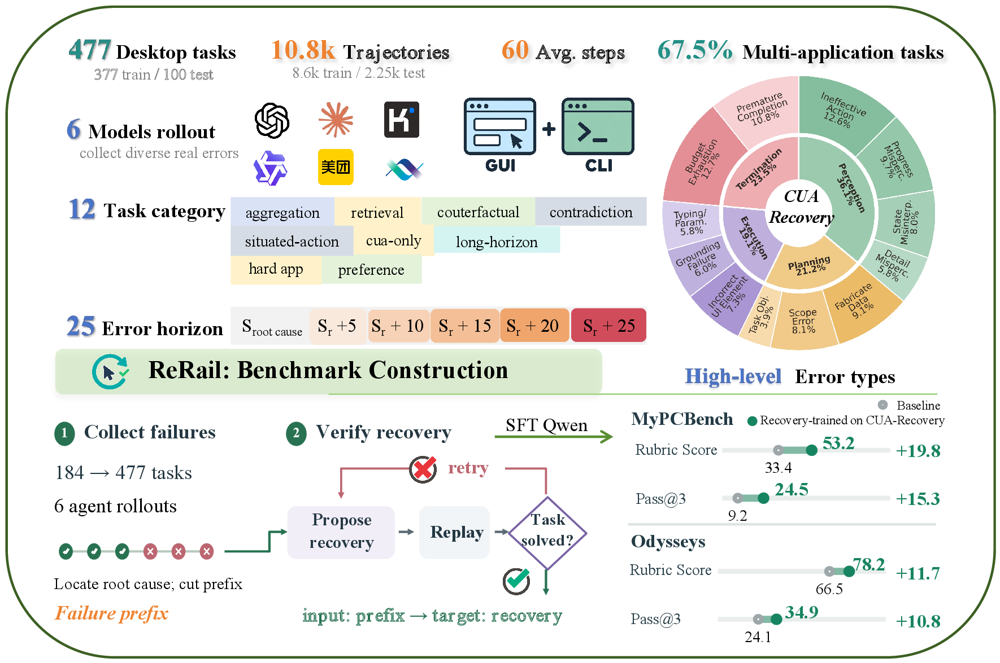

# CUA-Recovery: Benchmarking Error Recovery in Long-Horizon Computer-Use Agents

**A benchmark and a data pipeline for detecting and recovering from policy-induced errors in long, stateful computer-use workflows.**

<p align="center">
  
</p>

## 📢 News

- **[2026/09]** Code released.

## 📖 Overview

Computer-use agents increasingly run long workflows across several applications. An early wrong action is written into files, spreadsheets, or databases, stays hidden for many steps, and surfaces only after the step that caused it has left the agent's context.

**CUA-Recovery** measures whether an agent notices an inherited error and repairs it. It has two suites:

- **CUA-Recovery-Test**: 2,250 human-verified erroneous states over 100 tasks. An agent takes over each state *d* ∈ {0, 5, 10, 15, 20, 25} steps after the root cause, without an error warning.
- **CUA-Recovery-Train**: 8.6K verified recovery trajectories over 377 tasks.

Both suites are built with **ReRail**, which:

1. composes MyPCBench tasks into long multi-application workflows, each with a gold lineage that fixes the correct value at every step;
2. collects verifier-confirmed failures from several agents and locates each root cause against the gold lineage;
3. repairs unrelated earlier mistakes and replays each failure to controlled takeover depths;
4. generates recovery continuations under hints of increasing specificity and keeps only those the verifier accepts. Hints are removed from the training input.

Fine-tuning Qwen3.5-35B-A3B on CUA-Recovery-Train gives **ReRail-35B-A3B**.

## 🛠️ Installation

### Prerequisites

- Python 3.9 or higher
- Git and KVM to run the MyPCBench virtual machine (the image is about 16.5 GB)

### Setup

1. Clone the repository:
```bash
git clone https://anonymous.4open.science/r/CUA-Recovery-B03B
cd CUA-Recovery-B03B
```

2. Run the setup script. It creates a virtual environment, installs dependencies, fetches MyPCBench into `third_party/` at a pinned commit, applies `patches/`, and creates `.env`:
```bash
bash setup.sh
source .venv/bin/activate
```

3. Fill in `.env` with the API keys and endpoints you use.

## Hardware

- Open-weight agents are served with vLLM on AMD MI308X GPUs, 8 GPUs per job (TP=8).
- Smoke tests and API-based agents run on NVIDIA RTX A6000 (48 GB), TP=2.
- ReRail-35B-A3B is fine-tuned on 64 × AMD MI308X for 18 hours.

## Quick Start

Every stage runs through `main.py`:

```bash
python main.py --help                    # list all stages and commands
python main.py <stage> <command> --help  # arguments of one command
```

### 1. Build workflows (ReRail)

```bash
python main.py synthesis generate_tasks_v1 --ir-dir <accepted_ir_dir> --tasks <mypcbench_tasks.json> --out <bundle_dir>
python main.py synthesis freeze_source_splits
```

### 2. Collect rollouts

```bash
python main.py collection collect_all --confirm
```

### 3. Judge rollouts

```bash
python main.py judge judge_rubrics                     # latest collection, all agents
python main.py judge judge_rubrics v1 claude_opus_4_8  # one collection and agent
```

### 4. Build takeover states

```bash
python main.py benchmark analyze_failures_v1 --traces <traces> --ir-dir <ir_dir> --gold-dir <gold_dir> --out <analysis_dir>
python main.py benchmark prepare_clean_prefix --build-dir <build_dir> --human-labels-dir <labels_dir>
python main.py benchmark select_takeover_failures --build-dir <build_dir> --human-labels-dir <labels_dir> \
    --source-agent <agent> --manifest <manifest.json> --list-file <list.tsv>
```

### 5. Take over and evaluate

```bash
BUILD_DIR=<build_dir> python main.py takeover run --source-agent claude_opus_4_8 --target-agent claude_opus_4_8
python main.py judge run_takeover_judge --source-agent claude_opus_4_8 --takeover-agent claude_opus_4_8 --depth 0 --condition unaware
python main.py judge summarize_takeover --output-root <takeover_output_root>
```

### 6. Build training data

```bash
python main.py train recovery_gen_v1 --cases <cases.jsonl> --gold-dir <gold_dir> --ir-dir <ir_dir> \
    --task-dir <task_dir> --qcow2 <mypcbench.qcow2> --live-db-dir <db_dir>
python main.py train build_training_v1 --traces <traces> --analyses <analyses> --gold-dir <gold_dir> \
    --ir-dir <ir_dir> --out <sft_dir>
```

## Benchmark

| Suite | Tasks | Examples | Labels |
|---|---|---|---|
| CUA-Recovery-Test | 100 | 2,250 erroneous states (602 / 443 / 373 / 328 / 273 / 231 at *d* = 0–25) | Human-verified |
| CUA-Recovery-Train | 377 | 8,577 verified recovery trajectories | Verifier-confirmed |

Rollouts are collected from GPT-5.5, Claude Opus 4.8, Kimi-K3, Qwen3.5-35B-A3B, EvoCUA-32B, and OpenCUA-72B. The dataset release is coming soon.

## Configuration

All parameters live in `configs/`. The defaults follow the paper.

| File | Controls |
|---|---|
| `configs/collection/mypcbench_runtime.yaml` | Clean-start budget (150 steps, 3,600 s), repeats (3), screenshots in context (20) |
| `configs/takeover/takeover.yaml` | Takeover budget (100 steps), depths, repeats, prefix repair, replay-state verification |
| `configs/environments/mypcbench_1280x800.yaml` | Determinism commands and per-step state probes |
| `configs/judges/default.yaml` | Judge model, Error Awareness Rate settings, Pass@k aggregation |
| `configs/synthesis/sampling_v1.yaml` | Workflow composition, mutation-test gate, dependency-length buckets |
| `configs/synthesis/workflow_splits_v1.yaml` | Train/test split (377 / 100) |
| `configs/train/sft_v1.yaml` | Hint schedule, teacher, leak filter, SFT objective and hyperparameters |
| `configs/agents/*.yaml` | Per-agent model, action space, and context settings |

## File Structure

```
CUA-Recovery/
├── main.py                 # Entry point for every stage
├── assets/                 # Figures
├── src/recovery/           # Core package
│   ├── gen/                # Workflow composition, frozen verifiers, splits
│   ├── ir/, world/         # Task IR and gold-lineage interpreter
│   ├── longhorizon/        # Task-IR extraction client, ontology and value types
│   ├── synthesis/          # Task-fragment validation
│   ├── detect/             # Latent-error profiles and mutation tests
│   ├── harness/            # Rollout harness over the in-VM control API
│   ├── rollout/            # Collection harness and state probes
│   ├── failure_analysis/   # Root-cause analysis against gold lineage
│   ├── annotation/         # Human-annotation records and labelling UI
│   ├── canonical/          # Canonical actions and trajectories
│   ├── derived/            # Derived-build layout and schema validation
│   ├── construction/       # Prefix repair and takeover-state selection
│   ├── takeover/, replay/  # Takeover protocol and replay verification
│   ├── mypcbench/          # Agent scaffolds for MyPCBench
│   ├── adapters/           # Native-history rendering per agent
│   ├── evaluation/         # Rubric Score and Pass@k
│   └── train/              # Recovery generation and SFT samples
├── scripts/                # Stage scripts called by main.py
│   ├── synthesis/  collection/  judge/  benchmark/
│   └── takeover/   train/       lib/
├── configs/                # All configuration
├── prompts/                # Agent, annotation and synthesis prompts
├── schemas/                # JSON Schemas for data formats
├── analysis/               # Annotation and error-taxonomy statistics
├── infra/                  # In-VM change-log triggers, tracer and control-API extension
├── serving/                # vLLM serving image for EvoCUA
└── patches/                # Patches applied to MyPCBench
```

## Evaluation Metrics

- **Error Awareness Rate (EAR)**: whether the agent explicitly recognizes a problem in the inherited work.
- **Rubric Score**: weighted fraction of rubric criteria satisfied.
- **Pass@3**: whether the task is fully completed in at least one of three runs. A run passes only if every criterion is satisfied.

## License

MIT License - see LICENSE file for details.
